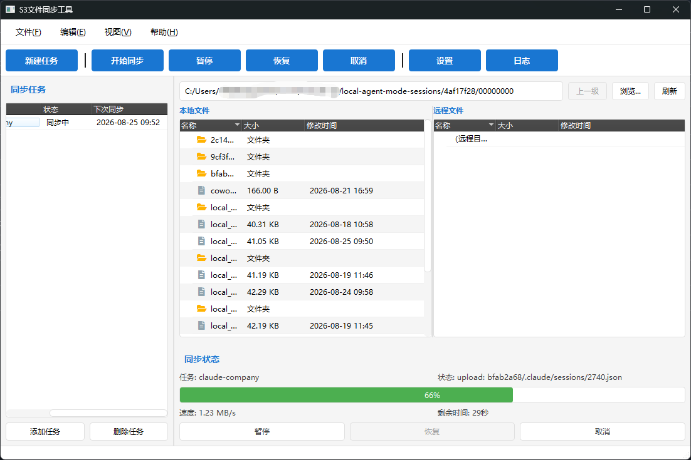
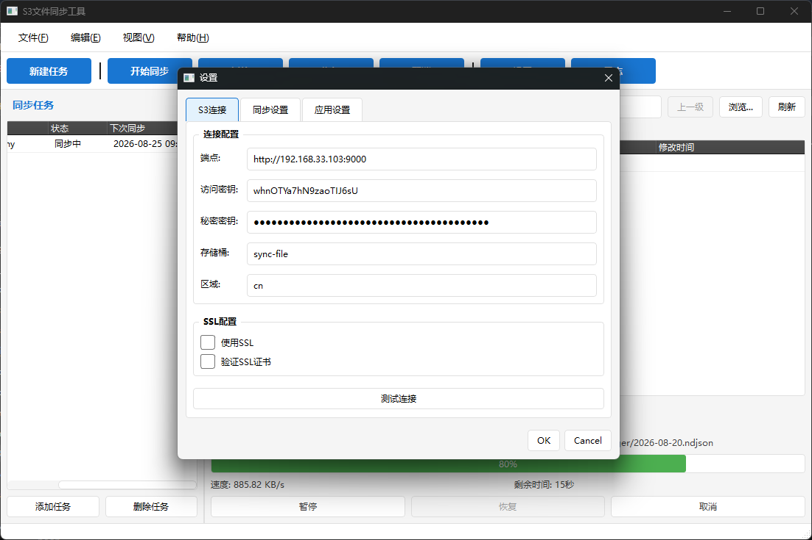
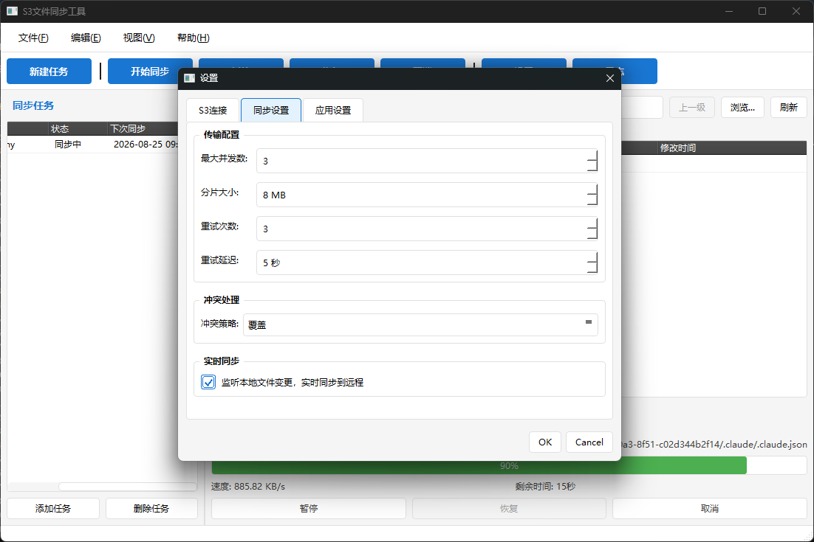

# S3文件同步工具

基于Python + PyQt6开发的S3文件同步工具，支持双向同步、断点续传、定时调度等功能。

## 功能特性

- ✅ **S3协议支持**: 兼容AWS S3、MinIO、阿里云OSS、腾讯云COS等S3兼容服务
- ✅ **双向同步**: 支持本地→远程、远程→本地、双向同步三种模式
- ✅ **断点续传**: 大文件分片传输，支持暂停和恢复
- ✅ **定时调度**: 支持定时自动同步，可配置同步间隔
- ✅ **冲突处理**: 提供重命名、覆盖、跳过、手动解决四种冲突处理策略
- ✅ **现代界面**: 基于PyQt6的现代化GUI界面
- ✅ **配置管理**: 支持配置导入导出，YAML格式配置文件

## 系统界面
### 任务同步进度
   

### 配置中心
 




## 系统要求

- Python 3.8+
- Windows/Linux/macOS

## 安装

### 1. 克隆项目

```bash
git clone <repository-url>
cd s3-sync-tool
```

### 2. 安装依赖

```bash
pip install -r requirements.txt
```

### 3. 运行应用

```bash
python main.py
```

## 使用说明

### 1. 配置S3连接

首次运行时，需要配置S3连接信息：

1. 点击菜单 **文件 → 设置** 或工具栏 **设置** 按钮
2. 在 **S3连接** 标签页填写：
   - **端点**: S3服务地址（如 `http://localhost:9000`）
   - **访问密钥**: Access Key
   - **秘密密钥**: Secret Key
   - **存储桶**: Bucket名称
   - **区域**: 区域（如 `us-east-1`）
3. 点击 **测试连接** 验证配置
4. 点击 **确定** 保存配置

### 2. 创建同步任务

1. 点击菜单 **文件 → 新建任务** 或工具栏 **新建任务** 按钮
2. 填写任务信息：
   - **名称**: 任务名称
   - **本地路径**: 要同步的本地目录
   - **远程前缀**: 远程存储路径前缀
   - **同步模式**: 双向同步/仅上传/仅下载
   - **同步间隔**: 自动同步间隔（秒）
   - **冲突策略**: 重命名/覆盖/跳过/手动解决
3. 点击 **确定** 创建任务

### 3. 执行同步

- **手动同步**: 选中任务，点击工具栏 **开始同步** 按钮
- **自动同步**: 启用任务后，系统会按设定的间隔自动同步

### 4. 查看同步状态

- 同步状态面板显示当前同步进度、速度、剩余时间
- 可点击 **暂停** 按钮暂停同步
- 可点击 **取消** 按钮取消同步

## 配置文件

配置文件位于 `~/.s3-sync-tool/config.yaml`，包含：

- **S3连接配置**: endpoint, access_key, secret_key, bucket等
- **同步配置**: max_concurrent, chunk_size, retry_times等
- **任务列表**: 所有同步任务的配置
- **应用设置**: auto_start, log_level等

### 配置示例

```yaml
# S3连接配置
s3:
  endpoint: http://localhost:9000
  access_key: your-access-key
  secret_key: your-secret-key
  bucket: sync-bucket
  region: us-east-1
  use_ssl: false
  verify_ssl: false

# 同步配置
sync:
  max_concurrent: 3
  chunk_size: 8388608
  retry_times: 3
  retry_delay: 5
  conflict_strategy: rename
  sync_mode: bidirectional

# 定时任务
tasks:
  - id: task-001
    name: 项目文档同步
    local_path: C:\Users\Documents
    remote_prefix: documents/
    interval: 3600
    enabled: true
    conflict_strategy: rename

# 应用设置
app:
  auto_start: false
  minimize_to_tray: true
  log_level: INFO
  log_file: logs/sync.log
```

## 打包为EXE

### 1. 安装PyInstaller

```bash
pip install pyinstaller
```

### 2. 打包应用

```bash
pyinstaller build.spec
```

打包完成后，可执行文件位于 `dist/S3FileSync.exe`

## 开发说明

### 项目结构

```
s3-sync-tool/
├── src/                      # 源代码
│   ├── core/                # 核心业务逻辑
│   │   ├── s3_client.py    # S3客户端
│   │   ├── sync_engine.py  # 同步引擎
│   │   ├── scheduler.py    # 定时调度器
│   │   └── transfer_manager.py  # 传输管理器
│   ├── gui/                 # GUI界面
│   │   ├── main_window.py  # 主窗口
│   │   ├── widgets/        # 自定义控件
│   │   └── dialogs/        # 对话框
│   ├── utils/              # 工具模块
│   │   ├── config_manager.py  # 配置管理
│   │   ├── logger.py       # 日志工具
│   │   ├── file_utils.py   # 文件工具
│   │   └── hash_utils.py   # 哈希工具
│   └── models/             # 数据模型
│       ├── file_info.py    # 文件信息
│       ├── sync_task.py    # 同步任务
│       └── transfer_state.py  # 传输状态
├── config/                  # 配置文件
├── tests/                   # 测试代码
├── requirements.txt         # Python依赖
├── main.py                  # 应用入口
├── build.spec              # PyInstaller配置
└── README.md               # 项目说明
```

### 核心模块说明

#### S3客户端 (s3_client.py)

封装boto3 S3操作，提供统一的文件传输接口：
- 连接管理
- 文件上传/下载
- 文件列表查询
- 文件删除/复制
- 元数据管理

#### 同步引擎 (sync_engine.py)

实现文件同步逻辑：
- 文件扫描
- 变更检测
- 同步策略
- 冲突处理
- 状态跟踪

#### 传输管理器 (transfer_manager.py)

管理文件传输过程，实现断点续传：
- 分片管理
- 进度跟踪
- 断点续传
- 并发控制
- 重试机制

#### 定时调度器 (scheduler.py)

管理定时同步任务：
- 任务配置
- 任务执行
- 任务监控
- 失败重试

## 常见问题

### 1. S3连接失败

- 检查endpoint地址是否正确
- 检查access_key和secret_key是否正确
- 检查bucket是否存在
- 检查网络连接

### 2. 同步冲突

- 使用重命名策略会创建冲突副本
- 使用覆盖策略会用较新的文件覆盖
- 使用跳过策略会跳过冲突文件
- 使用手动解决策略需要用户手动处理

### 3. 大文件传输失败

- 检查磁盘空间是否充足
- 检查网络连接是否稳定
- 尝试减小分片大小
- 查看日志了解详细错误信息

## 许可证

MIT License

## 联系方式

如有问题或建议，请提交Issue或Pull Request。
